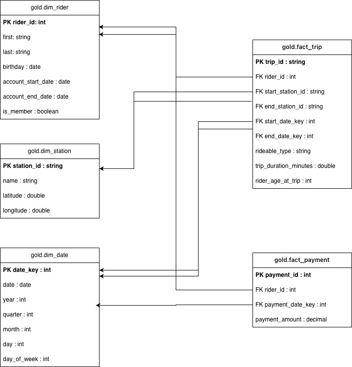

# Divvy Bike Sharing Lakehouse Project from Data lakes and Lakehouses with Spark and Azure Databricks Cours ([Udacity](https://www.udacity.com/enrollment/cd11531))

This repository contains my Udacity project solution for building a lakehouse pipeline in Azure Databricks for the Divvy bike sharing dataset.

## Repository Contents

- `Project BikeShare.ipynb`: Databricks notebook export with the full Bronze, Silver, Gold implementation.
- `Project BikeShare.py`: source-export version of the same notebook logic.
- `BikeSharingProject_GoldDB.drawio.png`: final Gold star schema diagram.
- `course_files/`: supporting Udacity course materials (not part of the graded project solution).

## Dataset and Ingestion

The project uses four CSV files:

- trips
- stations
- riders
- payments

In Databricks, these files were manually uploaded to FileStore, then saved and read them from `/FileStore/tables/...` paths.

# Divvy Bike Sharing Lakehouse Project

This repository contains my Udacity project solution for building a lakehouse pipeline in Azure Databricks for the Divvy bike sharing dataset.

## Repository Contents

- `Project BikeShare.ipynb`: Databricks notebook export with the full Bronze, Silver, Gold implementation.
- `Project BikeShare.py`: source-export version of the same notebook logic.
- `BikeSharingProject_GoldDB.drawio.png`: final Gold star schema diagram.
- `course_files/`: supporting Udacity course materials (not part of the project solution).

## Dataset and Ingestion

The project uses four CSV files:

- trips
- stations
- riders
- payments

In Databricks, I uploaded these files through the **Upload files to DBFS** flow and read them from `/FileStore/tables/...` paths.

## Architecture Implemented
### Bronze Layer
- Ingested all 4 CSV files into Bronze Delta tables.
- Kept the data close to source format (raw landing layer).

### Silver Layer
- Renamed generic raw columns (`_c0`, `_c1`, ...) using the provided source schema.
- Applied data type casting for IDs, dates, timestamps, coordinates, and payment amounts.
- Created `trip_duration_minutes`.
- Filtered out rows with null required keys.
- Wrote cleaned Delta tables in overwrite mode.

### Gold Layer
Built a star schema with two fact tables and shared dimensions as required by the rubric.
- Dimensions:
  - `gold.dim_rider`
  - `gold.dim_station`
  - `gold.dim_date`
- Facts:
  - `gold.fact_trip` (includes `trip_duration_minutes` and `rider_age_at_trip`)
  - `gold.fact_payment` (includes `payment_amount`)

## Business Analysis Covered
The notebook includes analytics for:
1. Time spent per ride by date/time, station, rider age, and member type.
2. Money spent by month, quarter, year, and by rider characteristics.
3. Extra-credit style monthly analysis combining spend with rides/minutes per rider.

## Gold Star Schema Diagram

